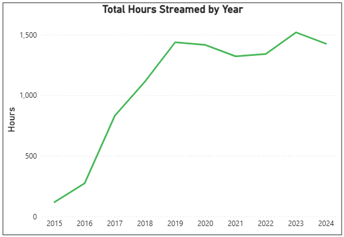
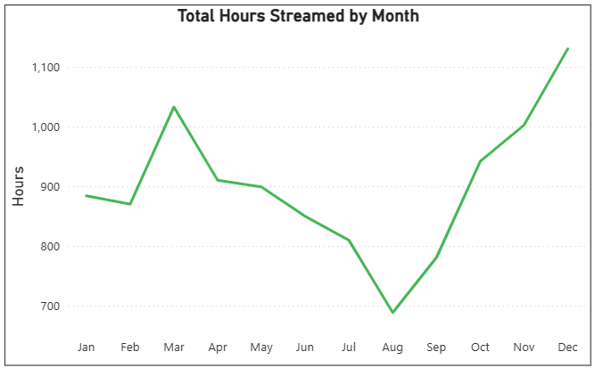
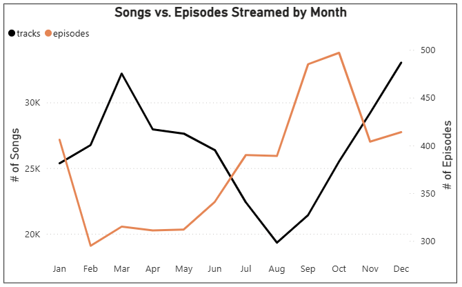
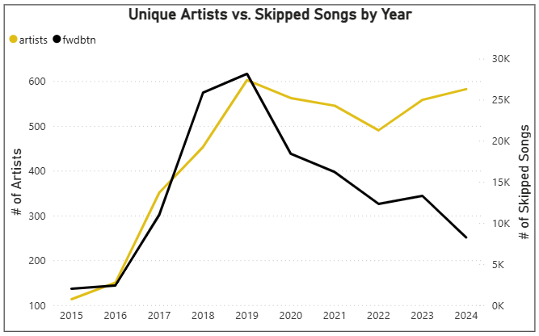
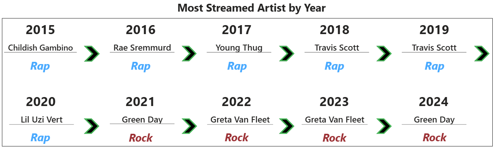

# Spotify Personal Streaming Analysis

  

## **Project Background**

### **Introduction** 
This project analyzes my personal Spotify streaming history from 2015 to 2024 to uncover listening habits and the evolution of my music taste using Power BI. Having been asked *"What kind of music do you listen to?"* more times than I could count, I began to wonder myself, and decided to take a data-driven look at my cumulative listening history. By exploring trends in what, when, and how I stream,this analysis aims is to draw objective conclusions about how my listening preferences have developed over time, and where they might be heading next.

### **About the Data**  
The dataset used in this analysis contains detailed records of my personal streaming activity throughout the full lifespan of my Spotify account, from 2015-2024. Each row represents a streamed song or podcast episode and includes metadata such as the date-time stamp (*ts*), identifying variables like track/episode name and artist/podcast name, and a key quantitative measure, duration played (*ms_played*). The data was delivered from Spotify via email, stored in 23 JSON files containing 327,123 total records. All files were combined and cleaned into one useable dataset titled *full_streaming_history*.

## **Executive Summary**
My overall streaming was dictated by my lifestyle and interests. Total streaming volume dipped during the summer months, reflecting seasonal lifestyle changes such as spending more time outdoors, where I am less likely to stream. Podcast streaming frequency dies in February, immediately following the Super Bowl, and gradually increases in the summer as NFL training camp news begins to break. Patience (compare ratios). Turning point in 2019, 
Unique artists and skips - exploring new music and finally started to find my taste once i began to give songs a chance. This allowed Spotify's impressive algorithims to properly gauge my taste, resulting in progressively fewer skips each year.

## **Data Preparation**

### **Data Aggregation** 
* Loaded all 23 files into Power Query and used *Append Queries as New* to insert all records into one usable dataset titled ***full_streaming_history***.
  * Since the column names and data structure in each original source file matched, no additional manipulation was required to standardize the data.
* After combining the datasets, I would typically disable loading for each individual query to optimize performance. However, since each source file contains sensitive personal information, I removed them completely.
  * Before deleting the individual queries, I created a static duplicate of ***full_streaming_history*** to eliminate dependencies and secure the model for public sharing.

### **Data Cleaning**
Deleted Columns

* ***ip_addr***, ***conn_country***, and ***platform*** to protect sensitive personal information.
* ***audiobook_title***, ***audiobook_uri***, ***audiobook_chapter_uri***, and ***audiobook_chapter_title***, as audiobooks are not a significant part of my listening profile.
* ***incognito_mode***, as this feature was never used on my account.

Renamed Columns

* *spotify_track_uri* → ***track_id***
* *spotify_episode_uri* → ***episode_id***
* *master_metadata_track_name* → ***track_name***
* *master_metadata_album_artist_name* → ***artist_name***
* *master_metadata_album_album_name* → ***album_name***
* *episode_show_name* → ***show_name***
  
Created Columns

* ***sec_played***, ***min_played***, and ***hrs_played*** as alternative measures of record duration.
* ***month_streamed***, ***hr_of_day_streamed***, and     ***day_of_week_streamed*** to facilitate analysis of listening patterns.
* ***month_abbr*** to include abbreviated month names.
* ***day_of_week_id*** and ***month_abbr*** to override default alphabetical sorting of categorical data.
* ***is_track*** to indicate records representing songs and ***is_episode*** to indicate podcast episode records.
* ***media_type*** to assign either 'Track' or 'Episode' to each record for labeling visuals.

Changed Data Types

* Converted all indicator variables from TRUE/FALSE to 1/0 (Whole Number) for compatibility in visuals.

## **Summary of Insights**
### **When I Listened: Temporal Patterns**
* Growth in total hours by year
* stuff

  

* I most frequently streamed from 12:00-2:00 P.M., with an additional spike from 7:00-9:00 P.M.
* Weekday streaming was consistent and followed the same time-of-day patterns displayed in the bar chart. Weekend activity was lower overall, with no clear temporal patterns.

  

* Total streaming volume fluctuated between months and displayed seasonality. Three of the four highest-volume months occurred during the fall (October-December), while all four of the lowest-volume months occurred during the summer (June-September).

  

* Monthly song volume closely mirrored the trend in total streaming hours, while podcast activity exhibited an inverse pattern.
  

  

### **How I Listened: Streaming Behaviors**

* The ratio of skipped songs to finished songs peaked from 2018-2019, with over 50% of songs skipped. The trend reversed beginning in 2020, eventually dropping to 35% in 2024. 

  

* The number of annual unique artists streamed on my account grew at nearly the same rate as the number of skipped tracks through 2019. From 2020 on, I continuted exploring a consistent number of artists each year, while the number of skipped songs decreased significantly.

  

### **What I Listened To: Evolution of Taste**
* Podcasts have become a much more prominent part of my streaming experience in recent years. From 2015-2021, podcast episodes accounted for just 2% of total streaming hours; from 2022-2024, that figure grew to 32%.
* Over 80% of my total podcast streaming hours were spent listening to just three shows.

  

* From 2015-2020, my most streamed artist each year was a rapper. Since 2021, each top artist has been a rock band. 

  

## **Reflections and Future Streaming**
Teenage Years  
College Years  
- sparked by being locked in the house with rock  
Recent Years  

* officially well rounded, but expecting more change! Impressionable listener and i am willing to give songs a chance with fewer skips!
* I streamed a consistent number of hours per year from 2019-2024, but composition went from nearly all music, to close to 50/50 split.
* I listen to a healthy mix of rock, alternative and bluegrass. This is a major shift from my high school and early college years, where I streamed mostly rap.
* My favorite artist is Green Day, streaming the most hours across multiple hours over many years. Walters / Olivia Rodrigo, but exclusively one album from each.
* I have grown into an inquisitive listener, as I skip fewer songs and branch out with more new artists. Part of this is due to the expert algos from spot.
