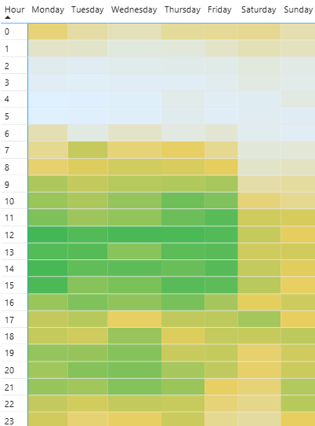

# Spotify Personal Streaming Analysis
*insert dashboard photo with link to live BI report

## Project Background

**Introduction** 
This project uses my personal streaming history from Spotify to identify my music taste and listening habits from 2015-2024 / year-to-year change. This dataset is really cool, as it is completely unique to me. Use this data to learn more about myself.

**About the Data**  
My full personal streaming history was delivered from Spotify via email, stored in 23 JSON files containing 327,123 total records. Each song or podcast episode streamed throughout the lifespan of my account is summarized in a row. ...information regarding when and for how long the record played. The unique identifier is the date-time-stamp (stored as ***ts***) of when the song or podcast was streamed.  
Records detailing a song include the artist, album name, and song title  
Podcasts include the show name and episode name.  
All media types in the dataset use *ms_played* representing the duration that the media was played for in milliseconds.
## Executive Summary

## Data Cleaning & Preparation

**Data Aggregation** 
* Loaded all 23 files into Power Query and used *Append Queries as New* to insert all records into one usable dataset titled ***full_streaming_history***
  * Since the column names and data structure in each original JSON file matched, no additional manipulation was required to standardize the data. 
* After combining the datasets, I would typically disable loading for each individual source query to optimize performance. In this case, since each file contains sensitive personal information, I replaced the combined query with a static, hard-coded copy to eliminate dependencies and secure the model for public sharing.

 

**Data Cleaning**  

Deleted Columns

* ***ip_addr***, ***conn_country***, and ***platform*** to protect sensitive personal information
* ***audiobook_title***, ***audiobook_uri***, ***audiobook_chapter_uri***, and ***audiobook_chapter_title***, as audiobooks are not a significant part of my listening profile
* ***incognito_mode***, as this feature has never been used on my account

Renamed Columns

* *spotify_track_uri* to ***track_id***
* *spotify_episode_uri* to ***episode_id***
* *master_metadata_track_name* to ***track_name***
* *master_metadata_album_artist_name* to ***artist_name***
* *master_metadata_album_album_name* to ***album_name***
* *episode_show_name* to ***show_name***
  
Created Columns

* ***sec_played***, ***min_played***, and ***hrs_played*** as alternative measures of record duration
* ***month_streamed***, ***hr_of_day_streamed***, and ***day_of_week_streamed*** to identify listening habits
  * also created ***day_of_week_id*** to order days of week Mon-Sun in visuals
* ***song*** to indicate if a record represents a song (TRUE) or podcast (FALSE)

## Summary of Insights
**Behaviors/Habits (year-to-year)**
* Podcast vs. Music Split
* Skipped songs

**Listening Patterns**

* I streamed the most media on weekdays, with spikes during the middle of the day and the evening.  

    

**Seasonality**
* Overall seasonality effect
* I streamed more podcast episodes and fewer songs during the summer and fall months due to NFL topics being discussed on my regularly streamed podcast channels.

**Evolution of Music Taste**  
Taste by Year  
Top artists and songs by year  
Frequency of top songs played (branching out more)
(AND! unique artists and songsby year)

**Current (Taste and Habits)**  
podcast/music split  
most played artists

## Recommendations
* My current taste is x, evolving from y
* My favorite artists are xyz
* Branched out in recent years