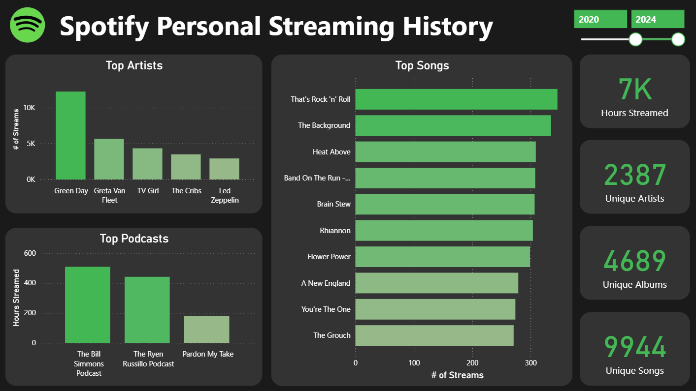
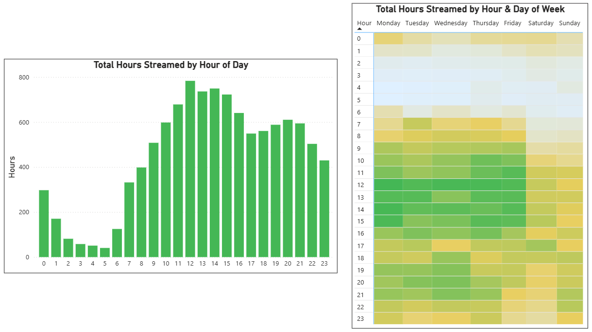
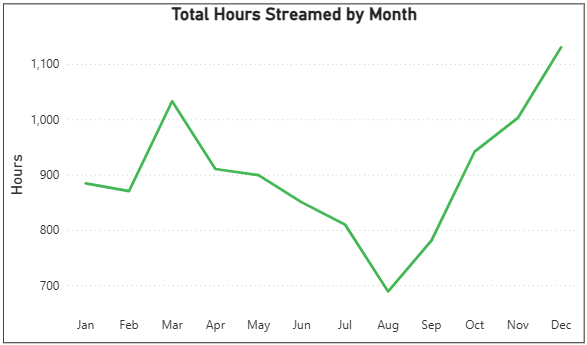
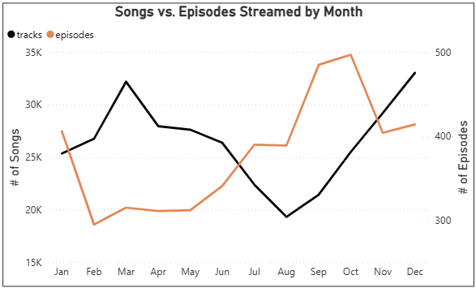
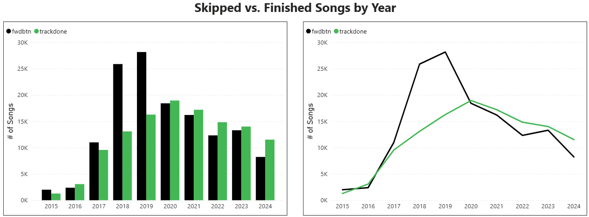
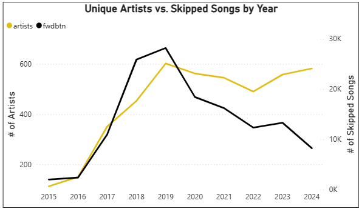
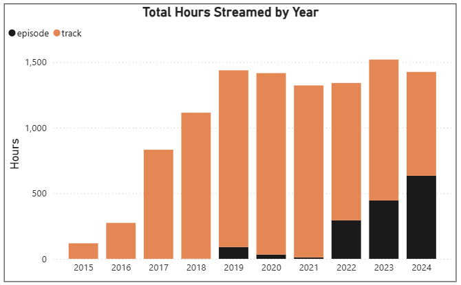
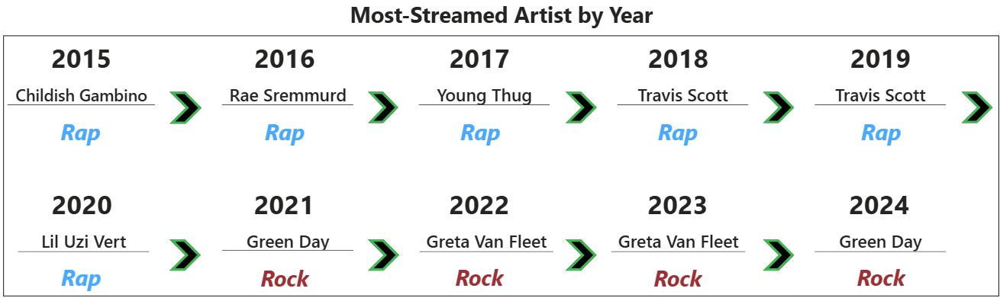
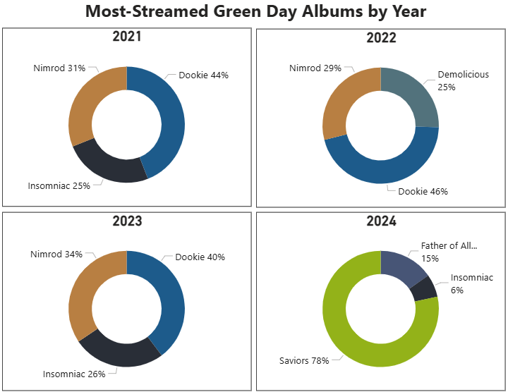

# Spotify Personal Streaming Analysis
By Nick Gasperi

  

## **Project Background**
### **Introduction**
This project analyzes my personal Spotify streaming history from 2015–2024 to uncover listening habits and the evolution of my music taste. Having been asked *"What kind of music do you listen to?"* more times than I could count, I began to wonder myself, and decided to explore my cumulative streaming history to find the answer. By identifying trends in what, when, and how I stream, this analysis aims to draw objective conclusions about how my listening preferences have developed over time, my current taste, and how I can maximize my future streaming experiences.

### **About the Data**  
The dataset used in this analysis contains detailed records of my personal streaming activity throughout the full lifespan of my Spotify account from 2015–2024. Each row represents a streamed song or podcast episode and includes metadata such as the date-time stamp (*ts*), identifying variables like track or episode name and artist or podcast name, and a key quantitative measure, duration played (*ms_played*). The data was delivered from Spotify via email, stored in 23 JSON files containing 327,123 total records. All files were combined and cleaned into one useable dataset titled *full_streaming_history*.

## **Executive Summary**
From 2015–2019, the total hours streamed on my Spotify account increased by over 1100%, reflecting a period of rapidly growing engagement. Streaming volume peaked in 2019 and has remained relatively stable since 2020.  

My streaming frequency varied by day of week and season. Weekday activity was consistently higher than weekends, streaming 24% more Monday–Friday. Total streaming also dipped notably during the summer months. This seasonality effect is captured by a 64% decrease in total hours streamed from December to August. Peak listening hours occurred between 12:00–2:00 P.M. and again between 7:00–9:00 P.M.  

During the earlier years of my account, I frequently skipped tracks while exploring a wide range of new artists, peaking in 2019 with a skip rate of over 50%. Skip rate steadily decreased year-over-year, falling to 33% in 2024, while exploring just 3% fewer unique artists.

My most-streamed artists from 2015–2020 were rappers; since 2021, each annual top artist has been a rock band. By 2024, my listening profile included a more balanced mix of media types, with annual podcast consumption increasing by 30% from 2019–2024.

## **Data Preparation**
### **Data Aggregation** 
* Loaded all 23 files into Power Query and used *Append Queries as New* to insert all records into one usable dataset titled ***full_streaming_history***.
  * Since the column names and data structure in each original source file matched, no additional manipulation was required to standardize the data.
* After combining the datasets, I would typically disable loading for each individual query to optimize model performance. However, since each source file contains sensitive personal information, I removed them completely.
  * Before deleting the individual queries, I created a static duplicate of ***full_streaming_history*** to eliminate external dependencies and secure the model for public sharing.

### **Data Cleaning**
Deleted Columns

* ***ip_addr***, ***conn_country***, and ***platform*** to protect sensitive personal information.
* ***audiobook_title***, ***audiobook_uri***, ***audiobook_chapter_uri***, and ***audiobook_chapter_title***, as audiobooks are not a significant part of my listening profile.
* ***incognito_mode***, as this feature was never used on my account.

Renamed Columns

* *spotify_track_uri* → ***track_id***
* *spotify_episode_uri* → ***episode_id***
* *master_metadata_track_name* → ***track_name***
* *master_metadata_album_artist_name* → ***artist_name***
* *master_metadata_album_album_name* → ***album_name***
* *episode_show_name* → ***show_name***
  
Created Columns

* ***sec_played***, ***min_played***, and ***hrs_played*** as alternative measures of record duration.
* ***month_streamed***, ***hr_of_day_streamed***, and     ***day_of_week_streamed*** to facilitate analysis of listening patterns.
* ***month_abbr*** to include abbreviated month names.
* ***day_of_week_id*** and ***month_abbr*** to override default alphabetical sorting of categorical data.
* ***is_track*** to indicate records representing songs and ***is_episode*** to indicate podcast episode records.
* ***media_type*** to assign either 'Track' or 'Episode' to each record for labeling visuals.

Changed Data Types

* Converted all indicator variables from TRUE/FALSE to 1/0 (Whole Number) for compatibility in visuals.

## **Summary of Insights**
### **When I Listened: Temporal Patterns**
* Total hours streamed per year increased by 1112% from 2015–2019, representing a period of rapid early growth in activity.
* Streaming has remained consistent since 2019, with a change of -0.8% in total hours between 2019 and 2024.

  

* I most frequently streamed from 12:00–2:00 P.M., with an additional spike from 7:00–9:00 P.M.
* Weekday streaming was consistent and followed the same time-of-day patterns. Weekend activity was lower overall and exhibited no clear temporal patterns.

  

* Total streaming volume varied seasonally. Three of the four highest-volume months occurred in the fall (October–December), while the four lowest-volume months fell in the summer (June–September).

  

* Within this overall trend, songs and podcast episodes followed markedly different seasonal paths.
* Monthly song volume closely followed the overall streaming trend, while podcast activity exhibited a contrasting seasonal pattern.
  

  

### **How I Listened: Streaming Behaviors**

* The percentage of songs skipped peaked in 2018–2019, when more than half of all tracks played were skipped before completion. Starting in 2020, my skip rate steadily declined, dropping to 35% in 2024. 

  

* From 2015–2019, the number of unique artists I streamed grew in tandem with my skip rate. This trend reversed in 2020, as I continued exploring a consistent number of artists each year, while the number of songs I skipped declined significantly.

  

### **What I Listened To: Evolution of Taste**
* From 2015–2021, podcast episodes accounted for just 2% of my total streaming hours. That figure grew to 32% from 2022–2024, reflecting a major shift in the type of media I regularly streamed.
* Over 80% of my total podcast streaming hours were spent listening to just three shows.

  

* From 2015–2020, my most streamed artist each year was a rapper. Since 2021, each top artist has been a rock band, signaling a major shift in genre preference.

  

* Green Day has emerged as my most consistently streamed artist in recent years.
* The majority of my Green Day streaming has been spent listening to classic albums. However, after spending a significant amount of time listening to the 2024 release, *Saviors*, my all-time streaming mix includes a blend of longtime favorites and newer releases. 

  

## **Reflections & Recommendations**
### **Reflections**
* My weekday streaming was significantly higher than weekends, reflecting a structured routine with more opportunities to listen after lunch and in the evening. Streaming activity on weekends and during the summer notably decreased, due to spending more time outdoors and in social settings.
* The frequency of my podcast streaming closely mirrors the NFL calendar. Streaming rises steadily beginning in May after the draft, peaks during the regular season, and tapers off late in the playoffs when there are fewer games to discuss. These trends align with periods when my regularly streamed podcasts release new episodes focused on NFL topics, which I am most likely to listen to.
* In my early streaming years, I frequently skipped songs while exploring new artists and genres. After my exploration peaked in 2019, I began to settle into my preferences, resulting in a declining skip rate despite trying new artists at a similar clip. This shift in behavior reflects both personal growth as a more patient listener, as well as improvements in Spotify's algorithms, which now suggests more songs I am likely to enjoy.
* Over the lifetime of my account, my music taste has grown to incorporate a diverse collection of genres. While early years featured almost exclusively rap, my preffered genre as of 2024 has shifted to rock, with alternative and bluegrass joining as supporing genres.

### **Recommendations**
1. Continue to stream at least 500 unique artists each year to encourage further diversity of my listening profile.
2. Embrace a more patient listening approch by continuing the trend of skipping fewew tracks each year, drop to 25% or lower.
3. Develop a more balanced seasonal streaming _ by decreasing listening during the winter months to spend more time away from devices.