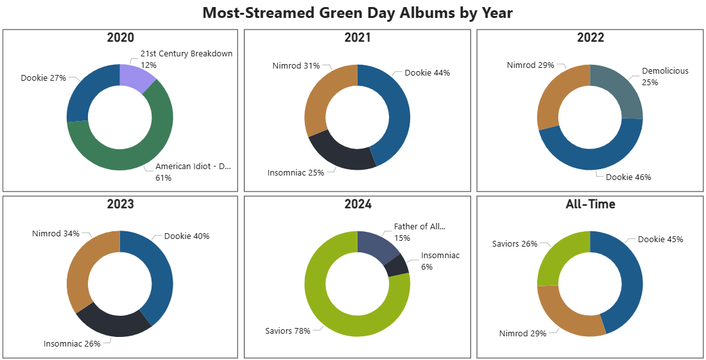

# Spotify Personal Streaming Analysis  

   
  <a href="https://github.com/nickgasperi/spotify-personal-streaming-analysis/raw/main/powerbi/spotify-personal-streaming-analysis_public.pbix"
  style="font-size:12px; font-style:italic;">
    Download Interactive Dashboard
  </a>

## **Project Background**
This project analyzes my personal Spotify streaming history from 2015–2024 to uncover listening habits and the evolution of my music taste. Having been asked *"What kind of music do you listen to?"* more times than I could count, I began to wonder myself, and decided to explore my cumulative streaming history to find the answer. By identifying trends in when, how, and what I streamed, this analysis aims to draw objective conclusions about how my listening preferences have developed over time and make recommendations to enhance my future streaming experience.

## **Data Overview**
The data was obtained from Spotify via email, stored in 23 JSON files containing 327,123 total records. All files were aggregated into one usable dataset titled ***full_streaming_history*** using Power Query. Each record represents a streamed song or podcast episode and includes metadata such as the date-time stamp, identifying variables like track or episode name and artist or podcast name, and quantitative measures such as duration played.

## **Executive Summary**
Between 2015–2019, the total annual hours streamed on my Spotify account increased by over 1100%, reflecting rapid growth in engagement. From 2019–2024, annual streaming volume remained relatively stable, decreasing by a marginal 0.8%. Streaming frequency varied by day of week and season. Weekday activity was consistently higher than weekends, streaming 24% more hours on average Monday–Friday. My streaming frequency also experienced seasonality, dipping notably during the summer months. Monthly streaming hours dropped by 64% from my most active period in December to my least active in August. Peak listening hours occurred from 12:00–2:00 P.M. and 7:00–9:00 P.M.

During the earlier years of my account, I frequently skipped tracks while exploring a wide range of new artists, peaking in 2019 with a skip rate of 54%. Skip rates steadily declined year-over-year, falling to 33% in 2024, while exploring just 3% fewer unique artists. My most-streamed artists from 2015–2020 were rappers; since 2021, each year's top artist has been a rock band. In recent years, my listening profile has featured a more balanced mix of media types. In 2019, 6% of my total streaming hours were spent listening to podcast episodes. By 2024, podcasts accounted for 45% of total streaming.

## **Data Preparation**
### **Data Aggregation** 
* Loaded all 23 files into Power Query and used *Append Queries as New* to combine all records into one usable dataset titled ***full_streaming_history***.
  * Since the column names and data structure in each original source file matched, no additional manipulation was required to standardize the data.
* After combining the datasets, I would typically disable loading for each individual query to optimize model performance. However, since each source file contains sensitive personal information, I removed them completely.
  * Before deleting the individual queries, I created a static duplicate of ***full_streaming_history*** to eliminate external dependencies and secure the model for public sharing.

### **Data Cleaning**
Deleted Columns

* ***ip_addr***, ***conn_country***, and ***platform*** to protect sensitive personal information.
* ***audiobook_title***, ***audiobook_uri***, ***audiobook_chapter_uri***, and ***audiobook_chapter_title***, as audiobooks are not a significant part of my listening profile.
* ***incognito_mode***, as this feature was never used on my account.

Renamed Columns

* *spotify_track_uri* → ***track_id***
* *spotify_episode_uri* → ***episode_id***
* *master_metadata_track_name* → ***track_name***
* *master_metadata_album_artist_name* → ***artist_name***
* *master_metadata_album_album_name* → ***album_name***
* *episode_show_name* → ***show_name***

Created Columns

* ***sec_played***, ***min_played***, and ***hrs_played*** as alternative measures of record duration.
* ***month_streamed***, ***hr_of_day_streamed***, and ***day_of_week_streamed*** to facilitate analysis of listening patterns.
* ***month_abbr*** to include abbreviated month names.
* ***day_of_week_id*** and ***month_abbr*** to override default alphabetical sorting of categorical data.
* ***is_track*** to indicate records representing songs and ***is_episode*** to indicate podcast episode records.
* ***media_type*** to assign either 'Track' or 'Episode' to each record for labeling visuals.

Changed Data Types

* Converted all indicator variables from TRUE/FALSE to 1/0 (Whole Number) for compatibility in visuals.

## **Key Insights**
### **When I Listened: Temporal Patterns**

  

* Total annual streaming hours increased by 1112% from 2015–2019. Streaming has remained consistent since 2019, with a change of -0.8% in total hours from 2019–2024.

 

  

* I most frequently streamed from 12:00–2:00 P.M., with an additional spike from 7:00–9:00 P.M., reflecting a structured routine with more opportunities to listen during lunch and in the evening. 
* Weekday streaming was consistent between days and mirrored the overall time-of-day pattern. Weekend activity was lower overall and exhibited no significant temporal patterns due to spending more time outside of my residence and in social settings.

 

  

* Total streaming frequency varied seasonally. Three of the four highest-volume months occurred in the fall (October–December), while the four lowest-volume months fell in the summer (June–September).
* Total streaming hours dropped 64% from the highest-streaming month (December) to the least active month (August). Similar to the dip in activity on weekends, I consumed far less media during the summer months while spending more time away from home without devices.

 

  

* Within the overall seasonal trend, music and podcast streaming exhibited differing seasonal patterns. Since music accounts for 86% of my total lifetime streaming, monthly song volume predictably followed the overall streaming trend.
* Podcast activity exhibited an inverted seasonal trend. My preference for podcasts that explore NFL topics shaped my seasonal podcast activity to mirror the NFL calendar. Podcast streaming rose steadily beginning in May after the NFL draft, peaked during the regular season, and tapered off late in the playoffs with fewer games to discuss each week. 

### **How I Listened: Streaming Behaviors**

  

* The percentage of songs I skipped peaked in 2019, skipping 54% of tracks prior to completion. Beginning in 2020, my skip rate steadily declined, dropping to 33% in 2024.
* Each year since 2020, I completed more songs than I skipped, indicating personal development as a patient listener.

 

  

* From 2015–2019, the number of unique artists I streamed grew in tandem with my skip rate. This trend reversed in 2020, as I continued exploring a consistent number of artists each year, while the rate at which I skipped songs declined. In 2024, I explored 3% fewer artists than in 2019, while skipping 71% fewer songs.

### **What I Listened To: Evolution of Taste**

  

* From 2015–2021, podcast episodes accounted for just 2% of my total streaming hours. In 2024, 45% of my total streaming was spent listening to podcasts, reflecting a major shift in the type of media I regularly consumed.
* My podcast exploration was less inquisitive than my music journey, as over 80% of my total podcast streaming hours were spent listening to just three shows.

 

  

* From 2015–2020, my most-streamed artist each year was a rapper. Since 2021, each top artist has been a rock band, signaling a shift in genre preference.

 

  

* Green Day has emerged as my most consistently streamed artist in recent years. The majority of my Green Day streaming consisted of songs from older, classic albums. However, after spending a significant amount of time listening to the 2024 release, *Saviors*, my all-time Green Day streaming mix includes a blend of longtime favorites and newer releases.

## **Recommendations**
1. Continue to stream at least 500 unique artists each year to encourage further genre diversity in my listening profile.
2. Embrace a more patient listening approach by continuing to finish more songs than I skip each year.
3. Stream 10% fewer hours during the winter months (December–March) to support my personal goal of spending less time on devices while at my residence.